<div align="center">
  
# 🌌 God-Level Skill Suite

<video src="./videos/God_Level_Skill_Suite_Trailer_Concept.mp4" width="88%" autoplay loop muted controls></video>

<br>

**52 Battle-Tested, Production-Grade AI Skills.** <br>
*Covering every dimension of modern software engineering. Zero Hallucination.*

<br>

[](#license)
[](https://pypi.org/project/god-skill-suite/)
[](#-the-52-skill-registry)
[](#-validated-ecosystem)
[](#-one-minute-deployment)

Built natively for **[Claude Code](https://claude.ai/code)**, **[Cursor](https://cursor.sh)**, **[Windsurf](https://windsurf.ai)**, **[Continue](https://continue.dev)**, **[Gemini CLI](https://github.com/google-gemini/gemini-cli)**, and more.

<br>

> ⭐ **If this makes your AI coding sessions dramatically better, please star the repo!**
> It helps other engineers discover the suite and motivates us to keep adding world-class skills.
>
> 📢 **Share it** with your team, in your Discord, or on Twitter/X — the more engineers use these skills, the more battle-tested they become.
>
> 🤝 **Want to contribute a skill?** Read the [Contribution Guide](CONTRIBUTING.md) — even a single high-quality skill makes a huge impact.

</div>

---

## 🎯 The Philosophy Grid

| 🛡️ Zero Hallucination | ⚔️ Researcher-Warrior | 🌐 Cross-Domain Mastery |
| :--- | :--- | :--- |
| **No guessing.** Strict anti-hallucination protocols force the model to invoke explicit uncertainty clauses rather than invent syntax or fabricate API behaviour. | **No passivity.** Every skill adopts the persona of a relentless engineer who traces bugs to their fundamental root and deeply interrogates every architectural decision. | **No role siloing.** A frontend engineer must understand Kubernetes networking. A DevOps engineer must understand OAuth flows. Lines fade deliberately. |

---

## ⚡ How It Works

<div align="center">

<table>
<tr>
  <td align="center" width="33%">
    <b>① The Problem</b><br/>
    <br/>
    <sub>Unguided AI hallucinates APIs, drops context, and produces insecure code</sub>
  </td>
  <td align="center" width="33%">
    <b>② The Activation</b><br/>
    <br/>
    <sub>Load a God-Level skill — it rewires the model's personality into a battle-hardened expert</sub>
  </td>
  <td align="center" width="33%">
    <b>③ The Result</b><br/>
    <br/>
    <sub>Zero Hallucination. Verified commands. Expert architectural judgment</sub>
  </td>
</tr>
</table>

</div>

---

## 🚀 One-Minute Deployment

<details>
<summary><b>🍎 macOS / 🐧 Linux (Recommended)</b></summary>
<br>

```bash
curl -fsSL https://raw.githubusercontent.com/gnanirahulnutakki/god-skill-suite/main/installer/install.sh | bash
```
</details>

<details>
<summary><b>🪟 Windows (PowerShell)</b></summary>
<br>

```powershell
irm https://raw.githubusercontent.com/gnanirahulnutakki/god-skill-suite/main/installer/install.ps1 | iex
```
</details>

<details>
<summary><b>🐍 PyPI (uv / pipx / pip)</b></summary>
<br>

Install safely from PyPI for global CLI access across your system.

```bash
# With uv (fastest)
uv tool install god-skill-suite && god-skills install

# With pipx
pipx install god-skill-suite && god-skills install

# Direct, no install required (run from cloned repo)
python installer/install.py
```
</details>

---

## 📚 The 52-Skill Registry

> [!IMPORTANT]
> **Always load `god-meta-conductor` first.** It is the baseline operating system — establishing Zero-Hallucination rules and scope-locking before any domain skill activates.

<details>
<summary><b>🧠 Core Development — 6 Skills</b></summary>
<br>

<div align="center">


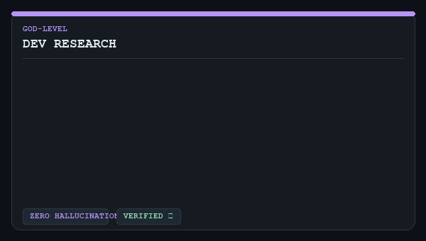
</div>
<div align="center">

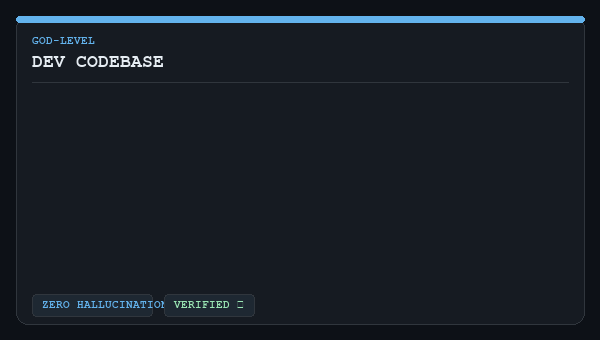
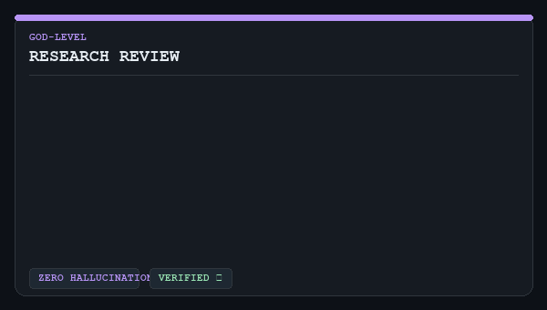
</div>
<br>

| Skill | Description |
|-------|-------------|
| `god-meta-conductor` | Master orchestrator — anti-hallucination, cross-domain thinking, researcher-warrior identity |
| `god-dev-core` | End-to-end software engineering: DSA, OOP, SOLID/DRY/YAGNI, design patterns, clean code |
| `god-dev-research` | Research methodology: finding papers, novelty checking, arXiv/ACM/IEEE, GitHub research |
| `god-dev-builder` | Building production systems: architecture decisions, scaffolding, iterative delivery |
| `god-dev-codebase` | Working with existing codebases: reading, debugging, refactoring, PR reviews |
| `god-research-review` | Deep research review: literature synthesis, critical analysis, experimental design |

</details>

<details>
<summary><b>🛡️ Security & IAM — 6 Skills</b></summary>
<br>

<div align="center">


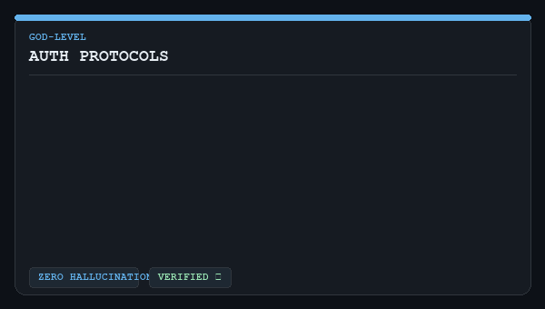
</div>
<div align="center">
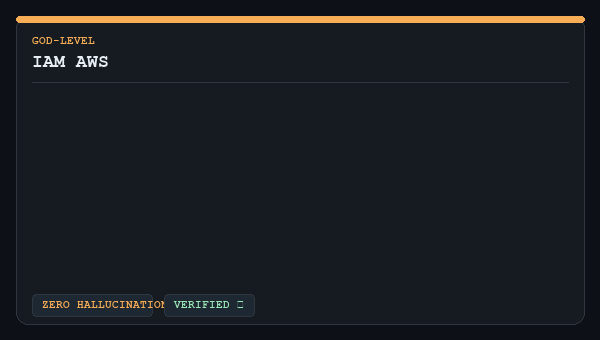
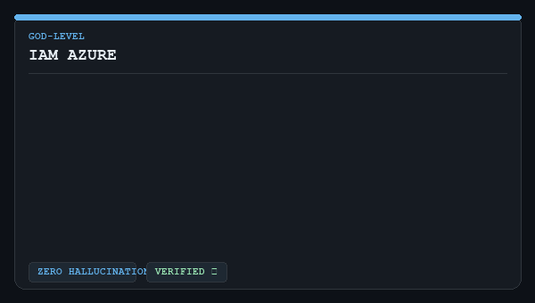
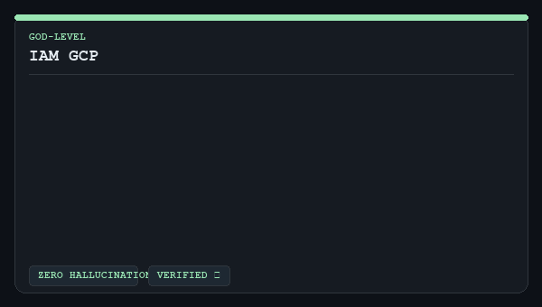
</div>
<br>

| Skill | Description |
|-------|-------------|
| `god-security-core` | STRIDE, OWASP Top 10, zero-trust, cryptography, SLSA, SBOM, Vault, container hardening |
| `god-security-cloud` | Cloud attack kill chain, privilege escalation, GuardDuty/Defender/SCC, CIEM |
| `god-auth-protocols` | OAuth 2.0 PKCE, OIDC, SAML 2.0, JWT, mTLS, SPIFFE/SPIRE, WebAuthn/passkeys |
| `god-iam-aws` | AWS IAM: policies, roles, SCPs, permission boundaries, IRSA, IAM Access Analyzer |
| `god-iam-azure` | Azure Entra ID: RBAC, Managed Identities, PIM, Conditional Access |
| `god-iam-gcp` | GCP IAM: resource hierarchy, Workload Identity, Organization Policy, IAM Deny |

</details>

<details>
<summary><b>⚙️ DevOps & Kubernetes — 5 Skills</b></summary>
<br>

<div align="center">

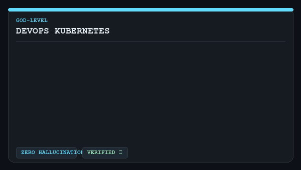
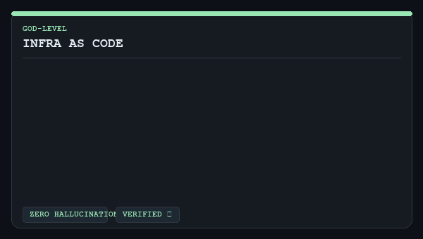
</div>
<div align="center">
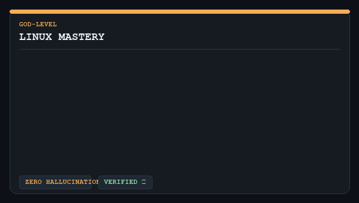
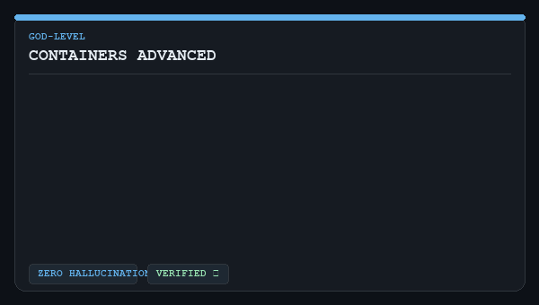
</div>
<br>

| Skill | Description |
|-------|-------------|
| `god-devops-core` | CI/CD pipelines, GitOps, Docker, Helm, deployment strategies |
| `god-devops-kubernetes` | Kubernetes deep dive: pods/services/ingress/RBAC/HPA/PDB/NetworkPolicy |
| `god-linux-mastery` | Linux internals, kernel/process/memory, eBPF/bpftrace, cgroups v2, systemd |
| `god-containers-advanced` | OCI spec, OverlayFS, BuildKit, multi-arch, rootless containers, gVisor/Kata |
| `god-infra-as-code` | Terraform (advanced HCL, state, modules), Pulumi, AWS CDK, Crossplane |

</details>

<details>
<summary><b>⛓️ Web3 & Data — 5 Skills</b></summary>
<br>

<div align="center">
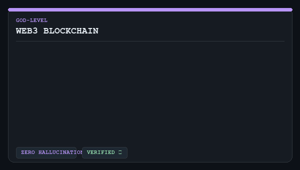
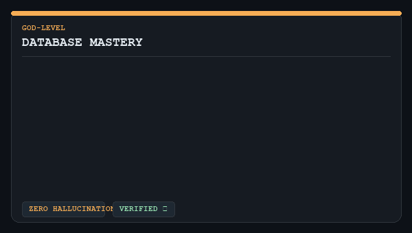
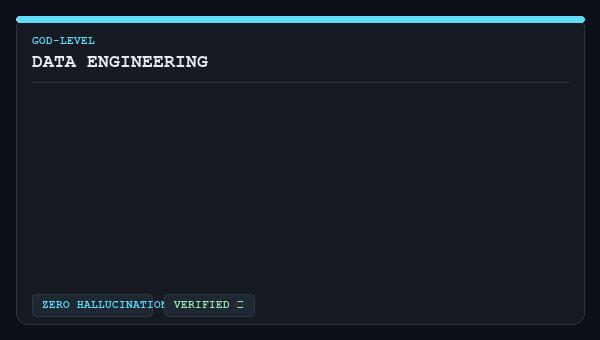
</div>
<div align="center">
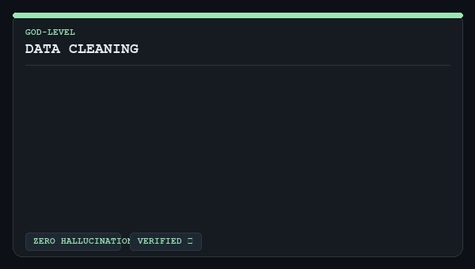
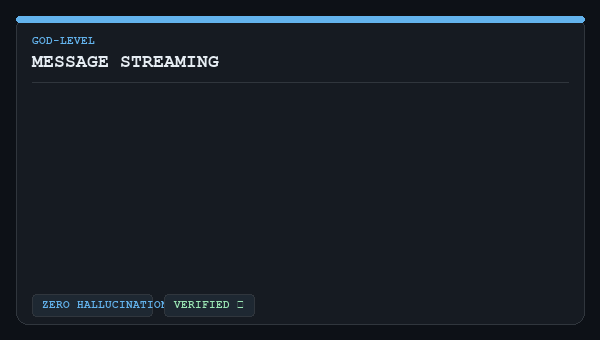
</div>
<br>

| Skill | Description |
|-------|-------------|
| `god-web3-blockchain` | Solidity, EVM internals, Rust (Solana), smart contract security, DeFi, gas optimization |
| `god-database-mastery` | PostgreSQL internals, EXPLAIN ANALYZE, indexing, sharding, replication, MongoDB, Redis |
| `god-data-engineering` | Spark, Flink, Airflow/Prefect, dbt, data modeling, lakehouse, streaming pipelines |
| `god-data-cleaning` | Data preprocessing, feature engineering, outlier detection, imputation, pipeline design |
| `god-message-streaming` | Kafka internals (ISR, EOS, Streams), RabbitMQ, SQS/SNS, NATS JetStream, Pulsar |

</details>

<details>
<summary><b>🎨 Frontend & UI/UX — 3 Skills</b></summary>
<br>

<div align="center">
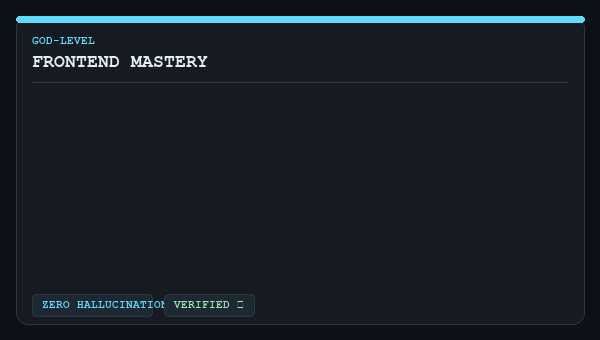
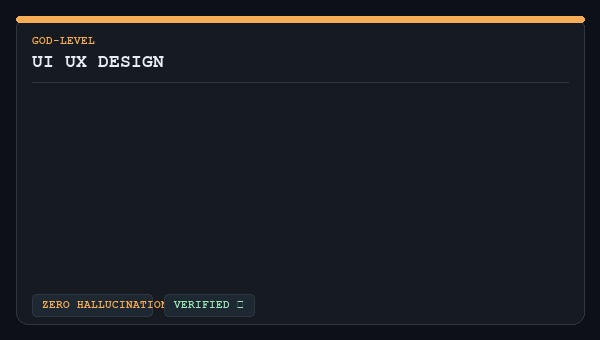
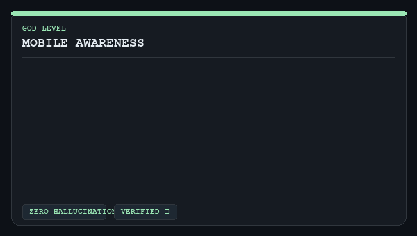
</div>
<br>

| Skill | Description |
|-------|-------------|
| `god-frontend-mastery` | React 18+, Next.js App Router, TypeScript, state management, Core Web Vitals, WCAG 2.2 |
| `god-ui-ux-design` | Interface design, HSL color theory, 8pt grids, accessibility WCAG 2.2, Spring physics |
| `god-mobile-awareness` | iOS/SwiftUI, Android/Compose, React Native, Flutter, PWA, push notifications |

</details>

<details>
<summary><b>🤖 MLOps & Applied AI — 6 Skills</b></summary>
<br>

<div align="center">
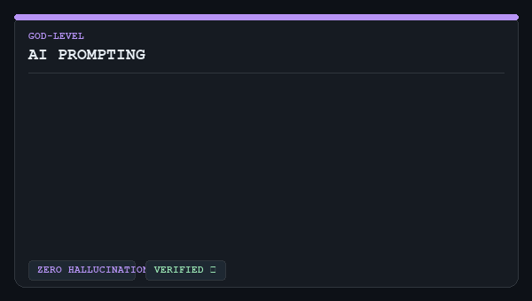


</div>
<div align="center">
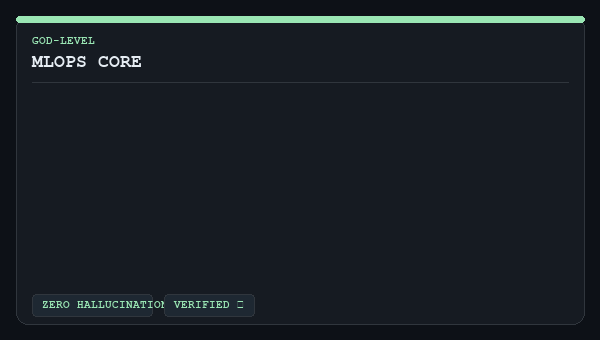


</div>
<br>

| Skill | Description |
|-------|-------------|
| `god-ai-prompting` | System prompts, chain-of-thought, few-shot, constitutional AI, evaluation |
| `god-ai-architect` | RAG, agents, tool use, multimodal, inference optimization, responsible AI |
| `god-llm-sdk` | Claude SDK, OpenAI SDK, LangChain, LlamaIndex, streaming, function calling |
| `god-mlops-core` | ML pipelines, model versioning (MLflow/W&B), serving, drift detection, A/B testing |
| `god-mlops-llm` | LLM fine-tuning (LoRA/QLoRA), RLHF, evaluation (RAGAS/DeepEval), LLMOps |
| `god-ml-data-training` | Data labeling, training loops, loss functions, distributed training, checkpointing |

</details>

<details>
<summary><b>☁️ Architecture & Systems — 4 Skills</b></summary>
<br>

<div align="center">
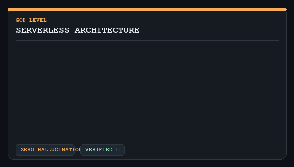
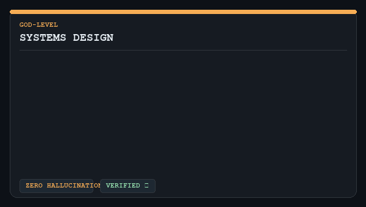
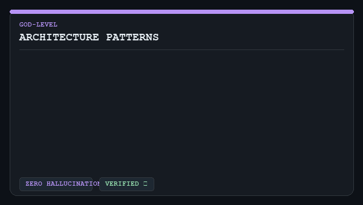
</div>
<div align="center">

</div>
<br>

| Skill | Description |
|-------|-------------|
| `god-serverless-architecture` | AWS Lambda, DynamoDB single-table, API Gateway, Step Functions, idempotency |
| `god-systems-design` | CAP/PACELC, consensus (Raft/Paxos), consistent hashing, CQRS, Event Sourcing, Saga |
| `god-architecture-patterns` | Microservices, DDD, hexagonal/clean/onion, strangler fig, event-driven, ADRs |
| `god-api-design` | REST (Richardson Maturity), GraphQL (N+1, DataLoader), gRPC, API versioning |

</details>

<details>
<summary><b>📊 Observability & Reliability — 4 Skills</b></summary>
<br>

<div align="center">
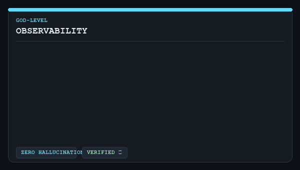
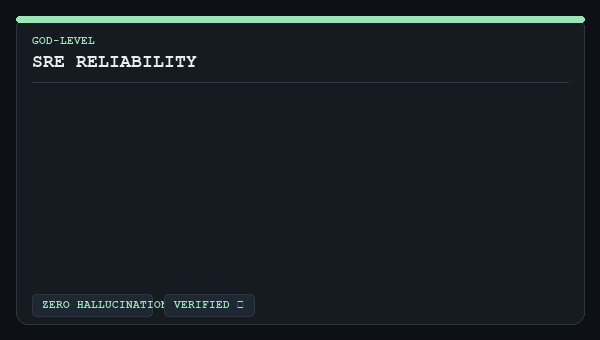
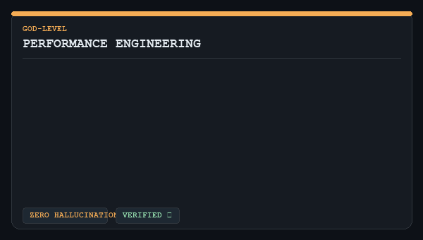
</div>
<div align="center">
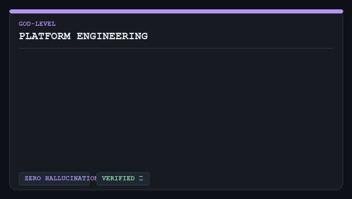
</div>
<br>

| Skill | Description |
|-------|-------------|
| `god-observability` | OpenTelemetry, Prometheus, Grafana, distributed tracing (Jaeger/Zipkin), alerting |
| `god-sre-reliability` | SLOs/SLIs/error budgets, toil reduction, capacity planning, incident response, GameDay |
| `god-performance-engineering` | CPU/memory profiling, flame graphs, JVM tuning, Go pprof, k6/Gatling |
| `god-platform-engineering` | IDP design, Backstage, golden paths, developer portals, paved roads |

</details>

<details>
<summary><b>🔍 Search, Vector & Edge — 4 Skills</b></summary>
<br>

<div align="center">
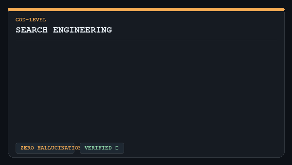
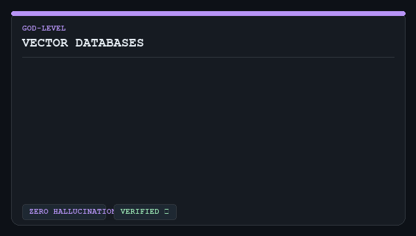
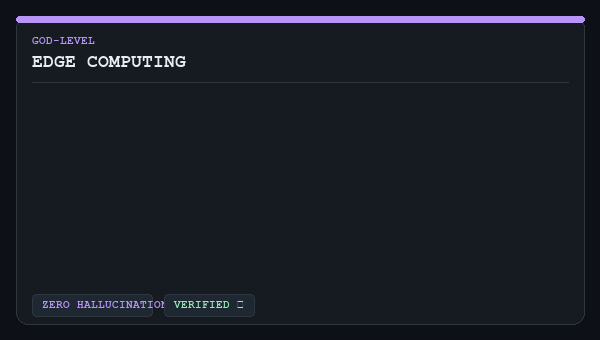
</div>
<div align="center">
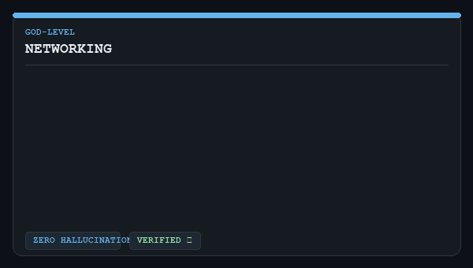
</div>
<br>

| Skill | Description |
|-------|-------------|
| `god-search-engineering` | Elasticsearch/OpenSearch internals, BM25 tuning, analyzer pipelines, relevance scoring |
| `god-vector-databases` | Pinecone, Qdrant, Weaviate, pgvector, Chroma, FAISS — ANN algorithms, HNSW, hybrid search |
| `god-edge-computing` | Cloudflare Workers (KV/R2/Durable Objects), Lambda@Edge, Fastly, Vercel Edge |
| `god-networking` | TCP internals (BBR/CUBIC), DNS, TLS 1.3, VPC design, BGP, eBPF, troubleshooting |

</details>

<details>
<summary><b>🛠️ Tooling, Compliance & Operations — 9 Skills</b></summary>
<br>

<div align="center">
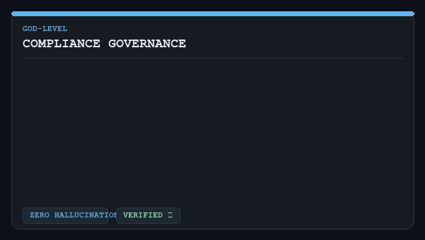
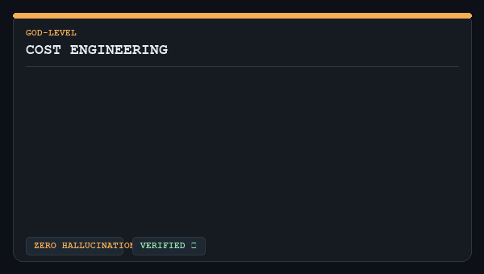
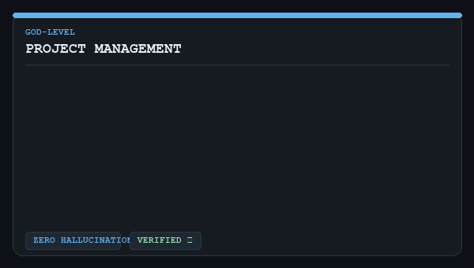
</div>
<div align="center">
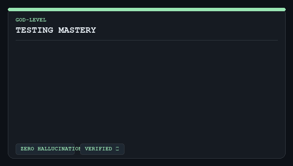


</div>
<div align="center">

</div>
<br>

| Skill | Description |
|-------|-------------|
| `god-compliance-governance` | SOC 2 Type II, HIPAA, PCI-DSS v4.0, GDPR, ISO 27001:2022, NIST 800-53 |
| `god-cost-engineering` | FinOps, cloud cost optimization, reserved instances, rightsizing, cost attribution |
| `god-project-management` | Agile/Scrum, Kanban, OKRs, RICE scoring, DORA metrics, blameless postmortems |
| `god-testing-mastery` | Unit/integration/E2E/contract/load/chaos/fuzz/mutation testing — full test pyramid |
| `god-git-workflow` | Git internals, rebasing, bisect, reflog, monorepo, hooks, conventional commits |
| `god-devex-tooling` | VS Code/JetBrains/Neovim mastery, tmux, fzf, ripgrep, debuggers, linters |
| `god-tech-support` | Full-stack troubleshooting: reading stack traces, log analysis, network debugging |
| `god-tech-support` | Kubernetes cluster triage, network debugging, systematic root-cause analysis |

</details>

---

## 🧪 Validated Ecosystem

Every skill ships with a **Prompt Library** (`prompts/examples.md`) and an **adversarial test suite** (`tests.json`) that runs against local Ollama models or frontier APIs to empirically prove Zero-Hallucination compliance.

```bash
# Run the full 52-skill test suite locally (requires Ollama)
python scripts/evaluate_skills.py --provider ollama --model qwen2.5:7b --output docs/TEST_RESULTS.md
```

→ See [docs/TESTING.md](docs/TESTING.md) for the full framework guide and [docs/TEST_RESULTS.md](docs/TEST_RESULTS.md) for latest results.

---

## 📄 License

MIT License — *Designed for builders who refuse to guess.*
